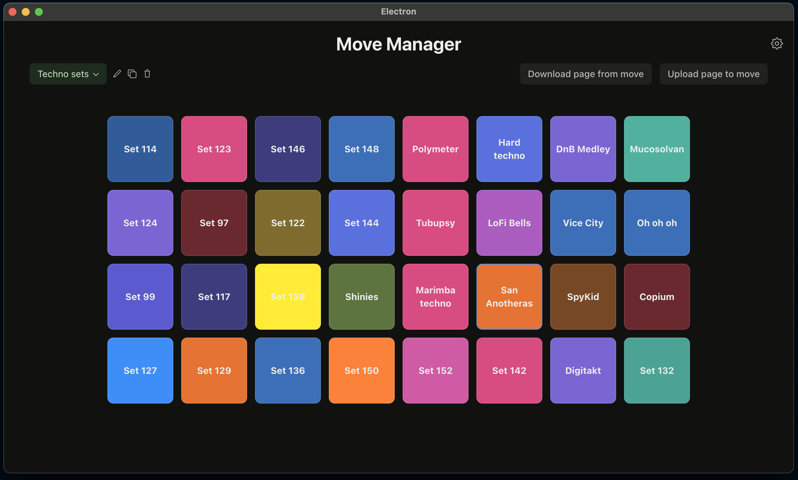

# Move Set Manager

*The Set Manager you wish came with Ableton Move.*

Move Set Manager is a powerful tool designed to enhance your Ableton Move experience by providing robust set management capabilities.



## Features

*   💾 **Backup and Restoration:** Easily back up your Ableton Move sets and restore them when needed.
*   📄 **Paging Support:** Organize your sets into pages. Upload an entire page of sets to your Move in seconds.
*   ✏️ **Metadata Editing:** Modify set details such as song name and pad color.
*   ⏳ **(Coming Soon!) Versioning Support:** Keep track of changes to your sets with version control.

## Caveats

*   🚫☁️ This tool does not play well with cloud synced sets. Please disable cloud syncing for sets if you want to use the upload functionality.
*   Syncing sets between devices works only for sets that do not have any custom samples. Proper support for this will be added soon.

## Getting Started

Follow these instructions to get Move Set Manager up and running on your system.

### Prerequisites

*   **SSH Access to your Move:** You'll need to have SSH access configured for your Ableton Move.
    *   Add an SSH key at `http://move.local/development/ssh`.
    *   Right now only SSH keys without passphrase are supported by the Move Set Manager. Support for passphrases will be added soon.
    *   If you don't have an SSH key, you can generate one. GitHub provides excellent documentation on [generating a new SSH key](https://docs.github.com/en/authentication/connecting-to-github-with-ssh/generating-a-new-ssh-key-and-adding-it-to-the-ssh-agent).
    *   Once your public key (e.g., `id_rsa.pub`) is added via the Move's web interface, you'll need to configure the path to your private SSH key within Move Set Manager's settings.
*   **Git:** This software uses Git for versioning your sets. Make sure [Git](https://git-scm.com) is installed and available in your system's command line.
*   **Node.js:** Node.js version 22 or higher is required. You can download it from [nodejs.org](https://nodejs.org/).

### Installation & Usage

**Disclaimer**: The Move Set Manager has been tested only on MacOS. Feel free to try it on different operating systems.

#### From prebuilt binaries
You can download the prebuilt binaries from the [releases page](https://github.com/Vratislav/move-set-manager/releases).

Only MacOs binaries are available at the moment.

#### From source code

1.  **Clone the repository:**
    ```bash
    git clone https://github.com/Vratislav/move-set-manager.git
    cd move-set-manager # Or your project's directory name
    ```
2.  **Install dependencies:**
    ```bash
    npm install
    ```
3.  **Start the application:**
    ```bash
    npm start
    ```
    This will launch the Move Set Manager.

## Contributing

We welcome contributions to Move Set Manager! If you'd like to help improve the project, please feel free to submit pull requests.

### Development Setup

1.  **Clone the repository:**
    ```bash
    git clone <repository-url>
    cd move-set-manager
    ```
2.  **Install dependencies:**
    ```bash
    npm install
    ```
3.  **Run in development mode:**
    ```bash
    npm run dev
    ```
    This will start the application with hot-reloading and other development features.

### Running Tests

To run the test suite (Docker is required):
```bash
npm test
```

### Development stack
* Electron based app in TypeScript
    * Backend is properly coded and MoveManageLib is covered with rudimentary tests
    * Frontend is React/RadixUI/trpc/TanstackQuery based. I have vibe coded it. It's a mess. I am so sorry. Any PRs improving the code structure are welcome.

## Contributors

Many thanks to the contributors who have helped discover and document Move's capabilities: bobbyd, charlesv, deets, fedpep, manuz, poga, void, and probably more.

## Move Hackers Community

Interested in chatting more about Ableton Move, development, or this tool? Come talk to us on [Discord](https://discord.gg/yP7SjqDrZG).

## Disclaimer

This project is not affiliated with, authorized by, or endorsed by Ableton. Use at your own risk.

*   This tool is third-party and requires SSH access to your Ableton Move. There's a real risk of breaking things, including potentially bricking your device.
*   Ableton cannot offer individual support if something goes wrong while using this tool.
*   If issues do arise, the [documented](https://ableton.centercode.com/project/article/item.html?cap=ecd3942a1fe3405eb27a806608401a0b&arttypeid=%7Be70be312-f44a-418b-bb74-ed1030e3a49a%7D&artid=%7BC0A2D9E2-D52F-4DEB-8BEE-356B65C8942E%7D) restore procedure for your Ableton Move is the fallback. You use this software at your own risk.
*   The authors and contributors of this tool cannot be held responsible for any damage or issues that may occur to your equipment or for any potential data loss. Always refer to official Ableton documentation when modifying your hardware.
